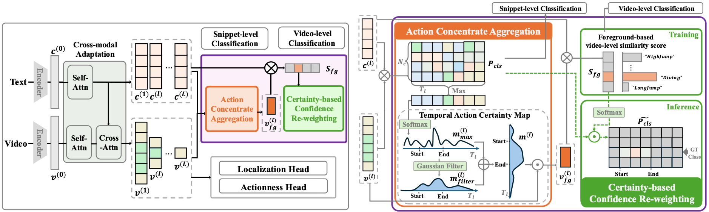

# [CVPR 2026 (Highlight)] TF-CADE: Foreground-Concentrated Text-Video Alignment for Zero-Shot Temporal Action Detection

This repository contains the official implementation code for the CVPR 2026 paper "TF-CADE: Foreground-Concentrated Text-Video Alignment for Zero-Shot Temporal Action Detection".



# Installation
1. Install the required packages
```bash
pip install  -r requirements.txt
```

2. Install NMS
```bash
cd ./libs/utils
python setup.py install --user
cd ../..
```

# Data Preparation
- We utilize the feature for THUMOS14 and ActivityNet v1.3 datasets from [ActionFormer](https://github.com/happyharrycn/actionformer_release) repository. 
- Please download these features using their link and extract them to the ./data folder.


# Training and Evaluation
```bash
# THUMOS14 dataset
bash scripts/thumos.sh

# ActivityNet v1.3 dataset
bash scripts/anet.sh
```

# Evaluation
```bash
# THUMOS14 dataset
python eval.py ./configs/thumos14_i3d.yaml ./ckpt/thumos14_i3d_<name>_<num_split>/ --n <num_split>

# ActivityNet v1.3 dataset
python eval.py ./configs/anet_i3d.yaml ./ckpt/anet_i3d_<name>_<num_split>/ --n <num_split>
```

# Acknowledgement
The codebase is based on [ActionFormer](https://github.com/happyharrycn/actionformer_release) and [GroundingDINO](https://github.com/IDEA-Research/GroundingDINO). We thanks the authors for their efforts.

# Citation
```bash
@inproceedings{lee2026tf,
  title={TF-CADE: Foreground-Concentrated Text-Video Alignment for Zero-Shot Temporal Action Detection},
  author={Lee, Yearang and Kim, Ho-Joong and Lee, Seong-Whan},
  booktitle={Proceedings of the IEEE/CVF Conference on Computer Vision and Pattern Recognition},
  pages={2843--2852},
  year={2026}
}
```